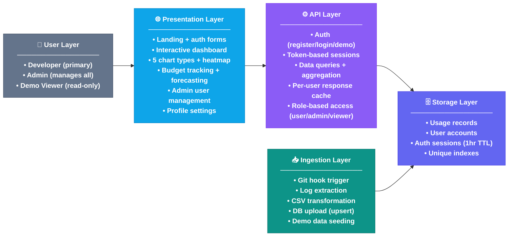
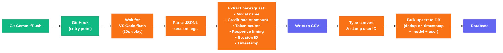
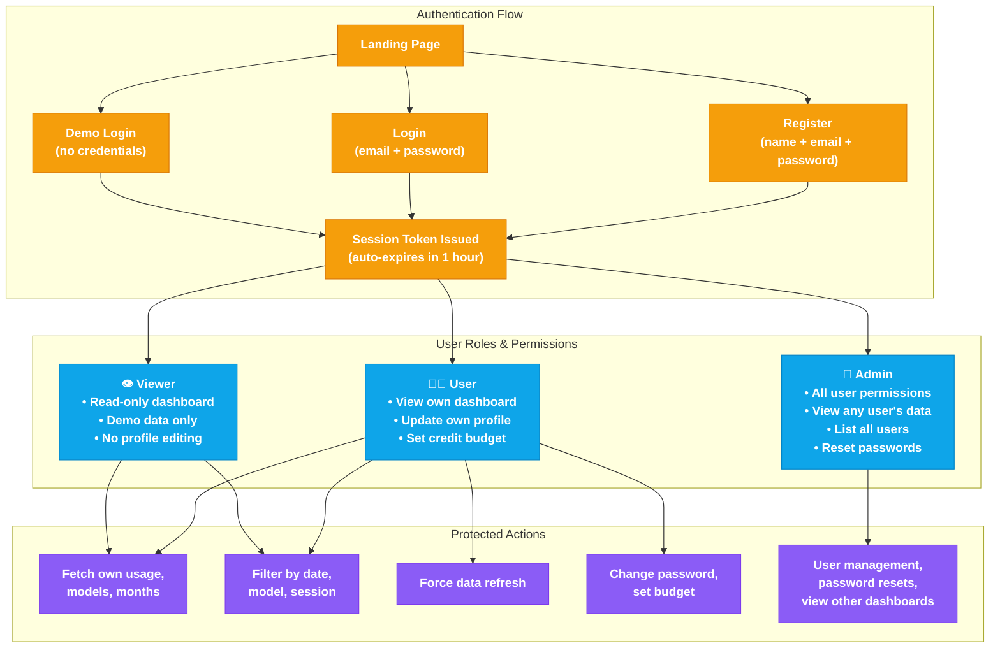
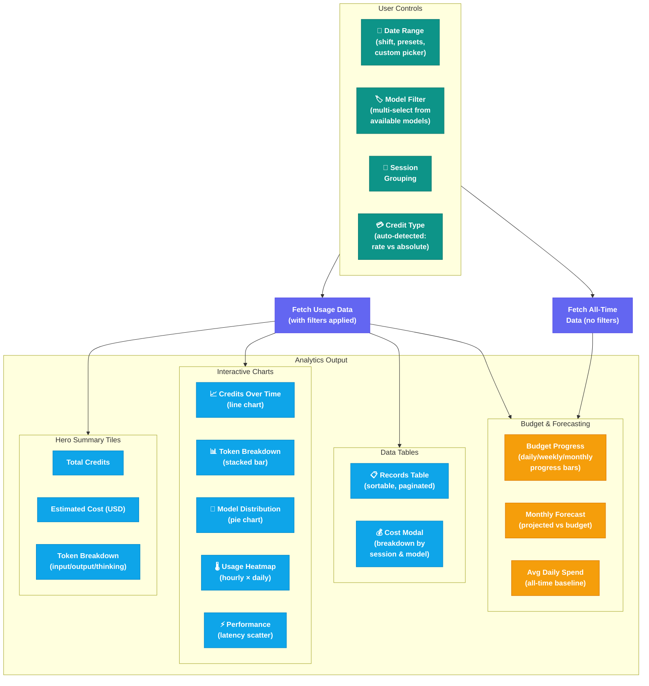

# GitHub Copilot Dashboard — Service Architecture

> A single-glance view of all service layers, workflows, and data flows.

## Complete Service Architecture

```mermaid
flowchart TB
    %% ━━━ STYLING ━━━
    classDef source fill:#0d9488,stroke:#0f766e,color:#fff,font-weight:bold
    classDef process fill:#f97316,stroke:#ea580c,color:#fff,font-weight:bold
    classDef store fill:#6366f1,stroke:#4f46e5,color:#fff,font-weight:bold
    classDef api fill:#8b5cf6,stroke:#7c3aed,color:#fff,font-weight:bold
    classDef frontend fill:#0ea5e9,stroke:#0284c7,color:#fff,font-weight:bold
    classDef auth fill:#f59e0b,stroke:#d97706,color:#fff,font-weight:bold
    classDef admin fill:#ec4899,stroke:#db2777,color:#fff,font-weight:bold
    classDef hook fill:#10b981,stroke:#059669,color:#fff,font-weight:bold
    classDef user fill:#64748b,stroke:#475569,color:#fff,font-weight:bold

    %% ━━━━━━━━━━━━━━━━━━━━━━━━━━━━━━━━━━━━━
    %% LAYER 1: DATA INGESTION PIPELINE
    %% ━━━━━━━━━━━━━━━━━━━━━━━━━━━━━━━━━━━━━

    subgraph INGEST["🔄 Data Ingestion Pipeline"]
        direction LR
        VSCODE["🖥️ VS Code\nWorkspace Storage\n(JSONL session logs)"]:::source
        HOOK["⚡ Git Hook\n(Entry Point)"]:::hook
        ANALYSIS["📜 Orchestrator Script\n(waits for log flush,\nruns pipeline in background)"]:::process
        EXTRACT["📊 Usage Extractor\n(parse JSONL → extract\nmodel, tokens, credits,\ntimings, sessions)"]:::process
        CSV["📄 CSV File\n(intermediate output)"]:::store
        UPLOAD["⬆️ DB Uploader\n(type-convert,\nstamp user ID,\nbulk upsert)"]:::process

        VSCODE --> HOOK
        HOOK -->|"triggers"| ANALYSIS
        ANALYSIS -->|"step 1"| EXTRACT
        EXTRACT -->|"writes"| CSV
        ANALYSIS -->|"step 2"| UPLOAD
        CSV -->|"reads"| UPLOAD
    end

    %% ━━━━━━━━━━━━━━━━━━━━━━━━━━━━━━━━━━━━━
    %% LAYER 2: DATABASE
    %% ━━━━━━━━━━━━━━━━━━━━━━━━━━━━━━━━━━━━━

    subgraph DB["🗄️ Database"]
        direction LR
        USAGE_COL["📋 Usage Records\n(model, tokens, credits,\ntimestamps, sessions)"]:::store
        USERS_COL["👤 Users\n(credentials, roles,\nbudget settings)"]:::store
        SESSIONS_COL["🔑 Sessions\n(auth tokens,\nauto-expire 1hr)"]:::store
    end

    UPLOAD -->|"upserts records\n(dedup: timestamp+model+user)"| USAGE_COL

    %% ━━━━━━━━━━━━━━━━━━━━━━━━━━━━━━━━━━━━━
    %% SEED DATA (auxiliary)
    %% ━━━━━━━━━━━━━━━━━━━━━━━━━━━━━━━━━━━━━

    SEED["🌱 Demo Data Seeder\n(generate 800-1000 records,\ncreate demo viewer account)"]:::process
    SEED -->|"inserts demo records"| USAGE_COL
    SEED -->|"creates demo user"| USERS_COL

    %% ━━━━━━━━━━━━━━━━━━━━━━━━━━━━━━━━━━━━━
    %% LAYER 3: API SERVER
    %% ━━━━━━━━━━━━━━━━━━━━━━━━━━━━━━━━━━━━━

    subgraph API["⚙️ API Server"]
        direction TB

        subgraph AUTH_ENDPOINTS["🔐 Authentication"]
            direction LR
            REGISTER["Register\n(name, email, password\n→ auto-login)"]:::auth
            LOGIN["Login\n(email, password\n→ token)"]:::auth
            DEMO["Demo Login\n(no credentials\n→ viewer token)"]:::auth
            LOGOUT["Logout\n(invalidate token)"]:::auth
            SESSION["Session Check\n(validate token\n→ user info)"]:::auth
        end

        subgraph DATA_ENDPOINTS["📡 Data Endpoints"]
            direction LR
            CACHE["🗃️ Response Cache\n(per-user, per-query,\n5 min TTL)"]:::api
            MODELS_EP["Models\n(distinct model list)"]:::api
            MONTHS_EP["Available Months\n(date range discovery)"]:::api
            USAGE_EP["Usage Records\n(filter by date, model;\ngroup by session;\ncredit parsing)"]:::api
            CLEAR_CACHE["Clear Cache\n(force refresh)"]:::api
        end

        subgraph ADMIN_ENDPOINTS["🛡️ Admin Endpoints"]
            direction LR
            LIST_USERS["List All Users\n(admin only)"]:::admin
            RESET_PW["Reset User Password\n(admin only;\ninvalidates sessions)"]:::admin
            VIEW_OTHER["View Any User's Data\n(admin override\non data endpoints)"]:::admin
        end

        subgraph PROFILE_EP["👤 Profile"]
            UPDATE_PROFILE["Update Profile\n(password, budget)"]:::api
        end
    end

    %% DB ↔ API connections
    USAGE_COL <-->|"query / aggregate"| DATA_ENDPOINTS
    USERS_COL <-->|"read / write"| AUTH_ENDPOINTS
    USERS_COL <-->|"read / write"| ADMIN_ENDPOINTS
    USERS_COL <-->|"read / write"| PROFILE_EP
    SESSIONS_COL <-->|"create / validate / delete"| AUTH_ENDPOINTS

    %% Cache feeds data endpoints
    CACHE -.->|"serves cached\nresponses"| MODELS_EP
    CACHE -.->|"serves cached\nresponses"| MONTHS_EP
    CACHE -.->|"serves cached\nresponses"| USAGE_EP

    %% ━━━━━━━━━━━━━━━━━━━━━━━━━━━━━━━━━━━━━
    %% LAYER 4: FRONTEND APPLICATION
    %% ━━━━━━━━━━━━━━━━━━━━━━━━━━━━━━━━━━━━━

    subgraph FRONTEND["🌐 Frontend Application"]
        direction TB

        subgraph LANDING["🏠 Landing Page"]
            direction LR
            SIGNUP["Sign Up Form"]:::frontend
            SIGNIN["Sign In Form"]:::frontend
            DEMO_BTN["View Demo\nDashboard"]:::frontend
        end

        subgraph DASH["📊 User Dashboard"]
            direction TB

            subgraph CONTROLS["🎛️ Controls & Filters"]
                direction LR
                MODEL_FILTER["Model Filter\n(multi-select)"]:::frontend
                DATE_NAV["Date Navigation\n(week/month shift,\npresets, custom range)"]:::frontend
                SESSION_TOGGLE["Session Grouping\nToggle"]:::frontend
                CREDIT_TOGGLE["Credit Type Toggle\n(auto-switch based\non data)"]:::frontend
                MONTH_PICKER["Month Quick-Picker\n(available months)"]:::frontend
                SYNC_BTN["🔄 Go Live\n(clear cache,\nrefresh data)"]:::frontend
            end

            subgraph SUMMARY["📈 Summary & Insights"]
                direction LR
                CREDITS_TILE["Credits Tile\n(total credits,\nrecord count)"]:::frontend
                COST_TILE["Cost Tile\n(estimated USD,\ngrand total)"]:::frontend
                TOKENS_TILE["Tokens Tile\n(input / output /\nthinking breakdown)"]:::frontend
                BUDGET_CARD["Budget Progress\n(daily / weekly /\nmonthly bars)"]:::frontend
                FORECAST_CARD["Monthly Forecast\n(projected spend,\nvs budget comparison)"]:::frontend
                AVG_SPEND["Avg Daily Spend\n(all-time baseline,\nweekly/monthly projection)"]:::frontend
            end

            subgraph VIZ["📉 Visualizations"]
                direction LR
                CREDITS_CHART["Credits Over\nTime (line)"]:::frontend
                TOKEN_CHART["Token Breakdown\n(bar)"]:::frontend
                PIE_CHART["Model Distribution\n(pie)"]:::frontend
                HEATMAP["Usage Heatmap\n(hourly / daily)"]:::frontend
                SCATTER["Performance\nAnalysis (scatter)"]:::frontend
            end

            subgraph TABLES["📋 Data Tables"]
                direction LR
                RECORDS_TABLE["Usage Records\n(sortable, paginated,\ncollapsible)"]:::frontend
                COST_MODAL["Cost Breakdown\nModal (by session\n& model)"]:::frontend
            end
        end

        subgraph ADMIN_UI["🛡️ Admin Panel"]
            direction LR
            USER_TABLE["User Management\nTable (search,\nlist all users)"]:::admin
            PW_RESET_MODAL["Password Reset\nModal"]:::admin
            USER_DASH["View User's\nDashboard"]:::admin
        end

        subgraph PROFILE_UI["⚙️ Profile Page"]
            direction LR
            BUDGET_INPUT["Set AI Credit\nBudget"]:::frontend
            PW_CHANGE["Change\nPassword"]:::frontend
        end
    end

    %% ━━━━━━━━━━━━━━━━━━━━━━━━━━━━━━━━━━━━━
    %% FRONTEND → API CONNECTIONS
    %% ━━━━━━━━━━━━━━━━━━━━━━━━━━━━━━━━━━━━━

    SIGNUP -->|"register"| REGISTER
    SIGNIN -->|"login"| LOGIN
    DEMO_BTN -->|"demo login"| DEMO

    CONTROLS -->|"fetch filtered data"| USAGE_EP
    CONTROLS -->|"fetch models"| MODELS_EP
    MONTH_PICKER -->|"fetch months"| MONTHS_EP
    SYNC_BTN -->|"clear + refetch"| CLEAR_CACHE

    ADMIN_UI -->|"list users"| LIST_USERS
    PW_RESET_MODAL -->|"reset password"| RESET_PW
    USER_DASH -->|"fetch user data\n(admin override)"| VIEW_OTHER

    PROFILE_UI -->|"update settings"| UPDATE_PROFILE

    %% ━━━━━━━━━━━━━━━━━━━━━━━━━━━━━━━━━━━━━
    %% USER ACTORS
    %% ━━━━━━━━━━━━━━━━━━━━━━━━━━━━━━━━━━━━━

    DEV["👨‍💻 Developer"]:::user
    ADMIN_USER["👑 Admin"]:::user
    DEMO_USER["👁️ Demo Viewer"]:::user

    DEV -->|"codes in VS Code\n(generates logs)"| VSCODE
    DEV -->|"signs up / logs in"| LANDING
    DEV -->|"analyzes usage"| DASH
    DEV -->|"manages settings"| PROFILE_UI

    ADMIN_USER -->|"manages users"| ADMIN_UI
    ADMIN_USER -->|"views any dashboard"| USER_DASH

    DEMO_USER -->|"explores demo"| DEMO_BTN
    DEMO_USER -->|"views read-only\ndashboard"| DASH
```

---

## Service Layer Summary

---

## Data Ingestion Flow (Hook-triggered)

---

## Authentication & User Roles

---

## Dashboard Analytics Flow

